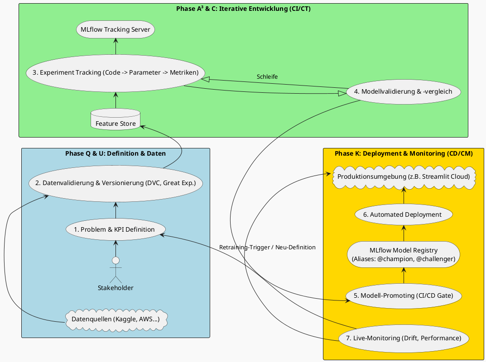

<!-- markdownlint-disable MD013 MD012 MD009 MD007 MD022 MD031 MD033 MD036 MD030 MD032 MD041 -->
# Der Modernisierte QUA³CK-Prozess - Von der Idee zur Cloud-App mit MLOps, MLflow und Streamlit

## Inhaltsverzeichnis

- [Der Modernisierte QUA³CK-Prozess - Von der Idee zur Cloud-App mit MLOps, MLflow und Streamlit](#der-modernisierte-quack-prozess---von-der-idee-zur-cloud-app-mit-mlops-mlflow-und-streamlit)
  - [Inhaltsverzeichnis](#inhaltsverzeichnis)
  - [Einleitung: Die Evolution der Entwicklung im Maschinellen Lernen](#einleitung-die-evolution-der-entwicklung-im-maschinellen-lernen)
    - [🎯 AMALEA Portfolio Context](#-amalea-portfolio-context)
    - [📹 AMALEA Video Integration](#-amalea-video-integration)
  - [Teil 1: Das Fundamentale QUA³CK-Prozessmodell](#teil-1-das-fundamentale-quack-prozessmodell)
    - [Phase Q - Question (Fragestellung)](#phase-q---question-fragestellung)
    - [Phase U - Understanding the data (Datenverständnis)](#phase-u---understanding-the-data-datenverständnis)
    - [Phase A³ - Die iterative A-Schleife (Algorithmus-Auswahl, Feature-Anpassung, Hyperparameter-Tuning)](#phase-a---die-iterative-a-schleife-algorithmus-auswahl-feature-anpassung-hyperparameter-tuning)
    - [Phase C - Conclude and compare (Schlussfolgerung und Vergleich)](#phase-c---conclude-and-compare-schlussfolgerung-und-vergleich)
    - [Phase K - Knowledge transfer (Wissenstransfer)](#phase-k---knowledge-transfer-wissenstransfer)
  - [Teil 2: MLOps - Engineering-Disziplin für Maschinelles Lernen](#teil-2-mlops---engineering-disziplin-für-maschinelles-lernen)
    - [Kernprinzip 1: Versionierung von allem (Code, Daten, Modelle)](#kernprinzip-1-versionierung-von-allem-code-daten-modelle)
    - [Kernprinzip 2: Automatisierung \& Continuous X (CI/CD/CT/CM)](#kernprinzip-2-automatisierung--continuous-x-cicdctcm)
    - [Kernprinzip 3: Umfassendes Testen im ML-Kontext](#kernprinzip-3-umfassendes-testen-im-ml-kontext)
    - [Kernprinzip 4: Modell-Governance \& Reproduzierbarkeit](#kernprinzip-4-modell-governance--reproduzierbarkeit)
  - [Teil 3: Synthese - Integration von MLOps in den QUA³CK-Prozess](#teil-3-synthese---integration-von-mlops-in-den-quack-prozess)
    - [Deep Dive: Modernisierung der A³-Schleife mit MLflow Tracking](#deep-dive-modernisierung-der-a-schleife-mit-mlflow-tracking)
    - [Deep Dive: Modernisierung von C \& K mit der MLflow Model Registry](#deep-dive-modernisierung-von-c--k-mit-der-mlflow-model-registry)
    - [Visualisierung: Modernisierter QUA³CK-Zyklus mit MLOps {#visualisierung}](#visualisierung-modernisierter-quack-zyklus-mit-mlops-visualisierung)
  - [Teil 4: System-Setup und Projektvorbereitung](#teil-4-system-setup-und-projektvorbereitung)
    - [1. Systemweite Werkzeuge (Prerequisites)](#1-systemweite-werkzeuge-prerequisites)
    - [2. Der MLflow Tracking Server](#2-der-mlflow-tracking-server)
      - [Installation](#installation)
      - [Starten des Servers](#starten-des-servers)
  - [Teil 5: Praxis-Projekt - Entwicklung und Deployment einer Iris-Klassifikator-App](#teil-5-praxis-projekt---entwicklung-und-deployment-einer-iris-klassifikator-app)
    - [Schritt 1: Projekt-Setup und Abhängigkeiten](#schritt-1-projekt-setup-und-abhängigkeiten)
      - [1. Projektstruktur und `requirements.txt`](#1-projektstruktur-und-requirementstxt)
      - [2. Virtuelle Umgebung und Installation](#2-virtuelle-umgebung-und-installation)
    - [Schritt 2: Modelltraining und Experiment-Tracking (Phase A³)](#schritt-2-modelltraining-und-experiment-tracking-phase-a)
    - [Schritt 2: Modell-Management und -Versionierung (Phase C)](#schritt-2-modell-management-und--versionierung-phase-c)
    - [Schritt 3: Qualitätssicherung durch automatisiertes Testen](#schritt-3-qualitätssicherung-durch-automatisiertes-testen)
      - [Erweiterte Pipeline: Vom Training zum Deployment mit GitHub Actions](#erweiterte-pipeline-vom-training-zum-deployment-mit-github-actions)
      - [Fairness / Segment Tests (Beispiel)](#fairness--segment-tests-beispiel)
    - [Schritt 4: Interaktive Web-App mit Streamlit (Phase K)](#schritt-4-interaktive-web-app-mit-streamlit-phase-k)
    - [Schritt 5: Deployment und Automatisierung (Continuous Delivery)](#schritt-5-deployment-und-automatisierung-continuous-delivery)
      - [1. Vorbereitung für das Deployment](#1-vorbereitung-für-das-deployment)
      - [2. Deployment in der Streamlit Community Cloud](#2-deployment-in-der-streamlit-community-cloud)
      - [3. Automatisierung mit GitHub Actions (CI/CD)](#3-automatisierung-mit-github-actions-cicd)
  - [Literaturempfehlungen und weiterführende Ressourcen](#literaturempfehlungen-und-weiterführende-ressourcen)
    - [Offizielle Projektseiten und Dokumentationen](#offizielle-projektseiten-und-dokumentationen)
    - [Tutorials und "How-To"-Anleitungen](#tutorials-und-how-to-anleitungen)
    - [Communitys und weiterführende Konzepte](#communitys-und-weiterführende-konzepte)
  - [Schlussfolgerung: Den vollen ML-Lebenszyklus meistern](#schlussfolgerung-den-vollen-ml-lebenszyklus-meistern)
  - [Nächste Schritte / Ausblick](#nächste-schritte--ausblick)

## Einleitung: Die Evolution der Entwicklung im Maschinellen Lernen

Die Entwicklung von Anwendungen des Maschinellen Lernens (ML) hat sich in den letzten Jahren fundamental gewandelt. Die zentrale Herausforderung in vielen ML-Projekten liegt heute weniger in der Auswahl des perfekten Algorithmus, sondern vielmehr im umgebenden Engineering. Zahlreiche vielversprechende Prototypen, die oft in Umgebungen wie Jupyter-Notebooks entstehen, erreichen niemals den produktiven Einsatz. Dieses Phänomen, oft als "Prototyping-Falle" oder "Proof-of-Concept-Gefängnis" bezeichnet, entsteht, weil die für die explorative Analyse optimierten Werkzeuge und Prozesse nicht für die Anforderungen eines stabilen, skalierbaren und wartbaren Betriebs ausgelegt sind. Der Grund hierfür ist häufig das Fehlen von strukturierten, reproduzierbaren und wartbaren Prozessen, die für den Übergang von der Forschung in den Betrieb unerlässlich sind.

An dieser Stelle setzt das am Karlsruher Institut für Technologie (KIT) entwickelte Vorgehensmodell QUA3CK an. Es bietet einen didaktischen und praxisorientierten Rahmen für ML-Projekte und gliedert diese in klar definierte Phasen. Dieses Modell liefert eine wertvolle Struktur, insbesondere für Einsteiger und in akademischen Kontexten. Es stößt jedoch in der modernen, agilen Softwareentwicklung an Grenzen, wenn es um Skalierbarkeit, Automatisierung und kontinuierliche Verbesserung geht. Der klassische QUA3CK-Prozess behandelt die Phasen oft als sequenzielle Schritte, was in der Praxis zu langen Entwicklungszyklen und einer schwierigen Wartung führt.

**AMALEA 2025** baut direkt auf diesem bewährten Fundament auf: Das **"Angewandte Machine Learning Algorithmen"** Programm des KI-Campus wird mit QUA³CK-Prinzipien und modernen MLOps-Praktiken kombiniert. So entsteht ein Kurs, der theoretische Klarheit mit industrieller Praxistauglichkeit verbindet.

### 🎯 AMALEA Portfolio Context

Für **AMALEA-Studierende der IU** ist dieses Handout direkt **portfoliorelevant**:
 
- **QUA³CK als Struktur**: Jede Portfolio-Komponente folgt den 5 QUA³CK-Phasen
- **MLOps als Standard**: Model Tracking, Versioning und Deployment Best Practices
- **Streamlit als Plattform**: 8 interaktive Apps für Streamlit Cloud
- **Big 3 Integration**: Decision Trees, KNN, K-Means mit MLflow Tracking
- **IU Assessment**: Erfüllung aller Bewertungskriterien durch strukturierten Ansatz

### 📹 AMALEA Video Integration

Die **22 originalen AMALEA-Videos** aus **2021-2025** werden systematisch in den MLOps-Workflow integriert:

- **Videos 1-7**: QUA³CK Foundation und Python Basics
- **Videos 8-14**: Big 3 Algorithms mit MLflow Tracking  
- **Videos 15-22**: Deployment, Portfolio und Assessment

Diese Video-Roadmap sorgt dafür, dass Sie Theorie, praktische Umsetzung und Portfolio-Anwendung nicht getrennt, sondern als zusammenhängenden Lernpfad erleben. Jede neue technische Komponente (z.B. Tracking, Registry, Deployment) wird didaktisch vorbereitet und direkt praktisch gefestigt.

Die Brücke zwischen der strukturierten Planung von QUA³CK und den Anforderungen der modernen Softwareentwicklung schlägt **Machine Learning Operations (MLOps)**. MLOps wendet die bewährten Prinzipien von DevOps (Kollaboration, Automatisierung, iterative Verbesserung) auf den gesamten Lebenszyklus von ML-Modellen an.

MLOps liefert damit die notwendige **Engineering-Disziplin**, um die in QUA³CK definierten Ziele in der Praxis umzusetzen – und das skaliert, automatisiert und kontinuierlich. Es ist keine bloße Werkzeugsammlung, sondern eine Kultur und ein Methodenset, das darauf abzielt, die Lücke zwischen der experimentellen Welt der Entwicklung (Data Science) und der stabilen Welt des Betriebs (Operations) systematisch zu schließen.

Dieses Handout führt Sie durch die Modernisierung des QUA³CK-Prozessmodells mit MLOps-Praktiken. Sie lernen nicht nur die Theorie, sondern wenden diese auch praktisch an, um eine robuste ML-Anwendung zu entwickeln und als interaktive Web-App bereitzustellen. Am Ende verstehen Sie, wie aus einem starren, linearen Prozess ein **dynamischer, sich selbst verbessernder Kreislauf** wird.

**Für AMALEA-Studierende** dient dieses Handout als theoretisches Fundament für alle **24 Portfolio-Komponenten** (16 Notebooks + 8 Streamlit Apps). Die hier vorgestellten Konzepte werden in den praktischen Notebooks der Wochen 1, 4 und 7 direkt umgesetzt und bereiten optimal auf die **IU-Fallstudien** vor.

## Teil 1: Das Fundamentale QUA³CK-Prozessmodell

> 🎥 **AMALEA Video-Integration**: Die folgenden Konzepte werden durch **originale AMALEA-Videos** aus 2021 vertieft  
> 🚀 **Portfolio-Kontext**: Diese Phasen strukturieren Ihre **IU-Fallstudien** und **Streamlit Cloud Apps**

Das QUA³CK-Modell ist ein Akronym, das die **fünf Hauptphasen** des Entwicklungsprozesses beschreibt. Die einzelnen Phasen werden nachfolgend anhand eines durchgehenden, klassischen Beispiels erläutert: der Klassifikation von Iris-Blüten.

Es ist wichtig zu verstehen, dass diese Phasen in der Realität **nicht streng getrennt** sind, sondern sich oft überlappen und Iterationen erfordern.

**AMALEA-Integration**: In den praktischen Notebooks werden diese Konzepte mit modernen Technologien wie **Docker**, **Streamlit** und **Hugging Face** umgesetzt.

- **Q** - Question (Fragestellung)
- **U** - Understanding the data (Datenverständnis)
- **A³** - Algorithmus-Auswahl, Feature-Anpassung, Hyperparameter-Tuning (iterative A³-Schleife)
- **C** - Conclude and compare (Schlussfolgerung und Vergleich)
- **K** - Knowledge transfer (Wissenstransfer)

### Phase Q - Question (Fragestellung)

> 🎯 **AMALEA-Kontext**: Dies entspricht der **Fallstudien-Definition** im IU-Assessment!

Jedes erfolgreiche ML-Projekt beginnt mit einer **präzisen Frage** oder einem klar umrissenen Problem. Eine vage Fragestellung ist einer der häufigsten Gründe für das Scheitern von Projekten, da sie zu unklaren Zielen und verschwendeten Ressourcen führt.

In dieser initialen Phase werden die Weichen für den gesamten weiteren Verlauf gestellt. Es ist entscheidend, nicht nur die technischen, sondern vor allem die **geschäftlichen Ziele** zu definieren. Dazu gehören:

-   **Anforderungen:** Was muss die Lösung können?
-   **Randbedingungen:** Welche technischen oder budgetären Einschränkungen gibt es?
-   **Erfolgskriterien (KPIs):** Woran wird der Erfolg des Projekts gemessen?

Eine saubere Klärung dieser Punkte verhindert, dass Spezifikationen zu spät angepasst werden oder das Endprodukt die Bedürfnisse der Anwender verfehlt.

**Für AMALEA-Studierende**: Ihre Fallstudien müssen eine **öffentlich zugängliche Streamlit Cloud App** und ein **GitHub Portfolio-Repository** umfassen. Die Problemstellung sollte als **Vorstudie für Ihr Bachelorprojekt** geeignet sein.

**Beispiel (Iris-Klassifikator):**

-   **Problemstellung:** Eine Anwendung soll Iris-Pflanzen basierend auf den Merkmalen ihrer Blüten (Kelch- und Kronblattlänge sowie -breite) automatisch einer von drei Spezies zuordnen: Setosa, Versicolor oder Virginica. Die Anwendung soll von Botanik-Studenten genutzt werden, um bei der Feldarbeit schnell eine Einschätzung zu erhalten.
-   **Anforderungen & KPIs:** Das entwickelte Modell soll eine Klassifikationsgenauigkeit (Accuracy) von über 95% auf bisher ungesehenen Daten erreichen. Die Vorhersagezeit pro Pflanze muss unter 500 Millisekunden liegen, um eine flüssige Benutzererfahrung zu gewährleisten.

**Warum diese Phase kritisch ist:** Unklare Ziele führen *downstream* zu ineffizientem Feature Engineering, zu breiten Suchräumen beim Modellieren und zu fehlgeleiteter Optimierung. Eine halbe Stunde mehr Präzision hier spart oft Tage später.

**Typische Stolpersteine:**
 
- Vage KPI ("hohe Genauigkeit") statt messbarer Schwelle
- Keine Definition von Constraints (Latenz, Speicher, Interpretierbarkeit)
- Keine frühe Abstimmung mit Stakeholdern → spätere Revisionsschleifen

**Mini-Checkliste:** Wer? Was? Warum jetzt? Erfolg wann messbar? Risiken? Abbruchkriterien?

### Phase U - Understanding the data (Datenverständnis)

> 📊 **AMALEA Big Data Integration**: Nutzen Sie [Kaggle](https://kaggle.com/datasets), [AWS Open Data](https://registry.opendata.aws/), [Google Dataset Search](https://datasetsearch.research.google.com/) für Ihre Projekte!

Diese Phase konzentriert sich auf die **Daten selbst** – das Herzstück jedes ML-Modells. Die Qualität der Daten bestimmt maßgeblich die Obergrenze für die Leistungsfähigkeit des späteren Modells. Falls kein Datensatz vorhanden ist, muss dieser zunächst erhoben werden.

Die Hauptaktivität ist die **explorative Datenanalyse (EDA)**. Hier werden die Rohdaten analysiert, um verborgene Muster, Trends oder Anomalien zu entdecken. Dies umfasst:

-   **Statistische Analysen:** Kennzahlen wie Mittelwert, Varianz und Korrelationen.
-   **Visualisierungen:** Diagramme wie Histogramme, Scatter-Plots oder Box-Plots, um Verteilungen und Beziehungen sichtbar zu machen.
-   **Datenvorverarbeitung:** Essenzielle Reinigungsschritte wie der Umgang mit fehlenden Werten, die Behandlung von Ausreißern und die Normalisierung von Features.

**AMALEA-Ressourcen**: Der Kurs stellt **diverse Big Data Quellen** bereit - von **Finanzdaten** (Yahoo Finance) über **wissenschaftliche Datasets** (NASA, UCI) bis zu **Social Media APIs** (Reddit, Spotify) für authentische Portfolio-Projekte.

**Beispiel (Iris-Klassifikator):**

-   **Datenanalyse:** Der bekannte Iris-Datensatz wird geladen. Mittels deskriptiver Statistik und Visualisierungen (z.B. Scatter-Plots, Box-Plots) werden die Verteilungen und Korrelationen der Merkmale (`sepal_length`, `sepal_width`, `petal_length`, `petal_width`) untersucht. Es wird festgestellt, dass `petal_length` und `petal_width` stark korrelieren und eine gute Trennung der Klassen ermöglichen.
-   **Datenvorverarbeitung:** Der Datensatz wird auf fehlende Werte überprüft (im Iris-Datensatz sind keine vorhanden). Es wird analysiert, ob Ausreißer existieren, die das Training beeinträchtigen könnten. Eine Skalierung der Features (z.B. Standardisierung) wird in Betracht gezogen, um sicherzustellen, dass alle Merkmale einen ähnlichen Einfluss auf das Modell haben, was besonders für abstandsbasierte Algorithmen wichtig ist.

**Vertiefung:** Datenverständnis ist **kein einmaliger Prozess**. Schon erste Modell-Runs geben Hinweise (z.B. Feature Importance, Fehlklassifikationen), die zurück in weitere Exploration fließen.

Deshalb ist es wichtig:

- EDA-Artefakte zu versionieren (z.B. Notebooks, Abbildungen).
- Wichtige Kennzahlen (Verteilungen, Korrelationen) als Referenz für späteres **Drift-Monitoring** zu sichern.

**Praktische Hinweise:**
 
- Früh ein initiales Daten-Profiling (z.B. with pandas-profiling/Great Expectations) generieren.
- Potenzielle Leaks markieren (z.B. Zielspalte in abgeleiteten Features versehentlich eingegangen?).
- Segmentierung vorbereiten (z.B. Gruppen-Attribute für Fairness später extrahieren).

### Phase A³ - Die iterative A-Schleife (Algorithmus-Auswahl, Feature-Anpassung, Hyperparameter-Tuning)

> 🎯 **AMALEA "Big 3"**: In **Woche 4** lernen Sie die drei wichtigsten ML-Algorithmen: **Decision Trees**, **K-Nearest Neighbors** und **K-Means Clustering**!

Diese drei Schritte bilden den **iterativen Kernzyklus** der Modellentwicklung. Es ist entscheidend zu verstehen, dass dies **kein linearer Ablauf** ist, sondern eine Schleife, die so oft durchlaufen wird, bis das Modell die gewünschten Ergebnisse liefert. In der Praxis ist dies oft der zeitaufwändigste Teil eines ML-Projekts.

**AMALEA-Erweiterung**: Zusätzlich zu klassischen Algorithmen lernen Sie **Neural Networks** (Woche 5), **Computer Vision mit CNNs** (Woche 6) und **moderne NLP mit Transformers** (Woche 6). Alle Experimente werden mit **MLflow Tracking** dokumentiert für professionelle Portfolio-Präsentation.

Der Zyklus besteht aus den folgenden, eng miteinander verknüpften Aktivitäten:

1.  **Algorithmusauswahl und Training:** Basierend auf der Problemstellung (z.B. Klassifikation, Regression), der Datenmenge und -art wird ein passender Algorithmus ausgewählt. Die Auswahl reicht von einfachen linearen Modellen bis hin zu komplexen neuronalen Netzen. Das Modell wird dann auf den aufbereiteten Trainingsdaten trainiert.

2.  **Datenanpassung (Feature Engineering):** Die Daten werden an die spezifischen Anforderungen des Algorithmus angepasst. Dies kann das Erstellen neuer Merkmale aus bestehenden (z.B. Polynom-Features), die Umstrukturierung von Daten oder die Reduktion von Merkmalen umfassen, um Überanpassung zu vermeiden.

3.  **Hyperparameter-Anpassung:** Hyperparameter sind die "Stellschrauben" eines Modells, die nicht während des Trainings gelernt werden (z.B. die Lernrate oder die Anzahl der Schichten in einem neuronalen Netz). Ihre Optimierung erfolgt manuell oder durch automatisierte Verfahren wie Grid Search, um die Modellleistung zu maximieren.

**Beispiel (Iris-Klassifikator):**

-   **A1 - Algorithmusauswahl:** Ein `RandomForestClassifier` aus scikit-learn wird als geeigneter, robuster Algorithmus für dieses tabellarische Klassifikationsproblem ausgewählt. **AMALEA-Erweiterung**: In Woche 4 vergleichen wir systematisch die "Big 3" Algorithmen, in Woche 5 ergänzen wir Neural Networks und in Woche 6 nutzen wir CNNs für Computer Vision.
-   **A2 - Datenanpassung:** Für den Random Forest sind die Daten bereits in einem passenden Format. **AMALEA-Praxis**: In den Streamlit-Apps lernen Sie interaktive Feature Engineering Tools und Data Augmentation für Computer Vision.
-   **A3 - Hyperparameter-Anpassung:** Die Hyperparameter des Modells, wie die Anzahl der Bäume (`n_estimators`) und die maximale Tiefe der Bäume (`max_depth`), werden durch systematisches Ausprobieren verschiedener Werte optimiert. **MLflow Integration**: Alle Experimente werden automatisch getrackt und sind über das MLflow UI vergleichbar.

Dieser Zyklus wird wiederholt, wobei die Leistung des Modells auf einem separaten **Validierungsdatensatz** gemessen wird, um eine Überanpassung an die Trainingsdaten zu vermeiden.

**Strategischer Fokus:** Ziel ist nicht das theoretisch beste Modell, sondern das **passendste unter realen Constraints** (Interpretierbarkeit, Kosten, Update-Frequenz). Ein leicht schwächeres, aber robusteres und schneller trainierbares Modell kann produktiv überlegen sein.

**Iterative Taktik:**
 
 1. Baseline (z.B. LogReg / Simple Tree) → Metriken festhalten
 2. Feature-Ideen bewerten (Hypothese → Experiment → Logging)
 3. Hyperparameter-Suche erst ausweiten, wenn Feature-Raum stabil
 4. Komplexität nur erhöhen, wenn Gap zu Ziel-KPI sonst nicht schließbar

**Overfit-Früherkennung:** Track Trainings- vs. Validierungs-Metrik Delta. Ab Delta > 0.03: Frühzeitig Regularisierung / Datenanreicherung / Feature-Reduktion prüfen.

### Phase C - Conclude and compare (Schlussfolgerung und Vergleich)

In dieser Phase wird die **Generalisierungsfähigkeit** des finalen Modells auf einem separaten **Testdatensatz** bewertet. Dieser Datensatz wurde während des gesamten Entwicklungszyklus noch nie vom Modell "gesehen" und dient als unvoreingenommener Maßstab.

Die Ergebnisse werden mit den in Phase Q definierten KPIs und eventuell mit Referenzmodellen ("Baselines") verglichen. Wenn die Leistung nicht ausreicht, ist dies ein klares Signal, zur A³-Schleife zurückzukehren.

**Beispiel (Iris-Klassifikator):**

-   Das optimierte `RandomForestClassifier`-Modell wird auf das Test-Set angewendet.
-   Die Genauigkeit wird berechnet und eine Confusion Matrix erstellt, um die Leistung im Detail zu analysieren (z.B. welche Klassen am häufigsten verwechselt werden).
-   Es wird festgestellt, dass das Modell die KPI von >95% Genauigkeit erfüllt. Die Vorhersagezeit wird ebenfalls gemessen und als zufriedenstellend bewertet.

**Bewertungssystem etablieren:** Nutzen Sie konsistente Vergleichstabellen (z.B. mit Run-ID, Accuracy, F1-Score, Latenz, Modellgröße). Ergänzen Sie qualitative Faktoren wie Erklärbarkeit und Stabilität. Ziel ist es, die Entscheidung für ein bestimmtes Modell nachvollziehbar zu dokumentieren.

**Output dieser Phase:**
 
- Bestes Modell + Metrik-Snapshot
- Entscheidungsprotokoll (warum dieses Modell)
- Offene Risiken (z.B. Performance auf seltenen Segmenten)

### Phase K - Knowledge transfer (Wissenstransfer)

Sobald ein Modell die Anforderungen erfüllt, ist es aus reiner Entwicklungssicht "fertig". Diese letzte, oft vernachlässigte Phase stellt sicher, dass das Modell **tatsächlich Wert schafft** und **nachhaltig betrieben** werden kann.

Sie umfasst zwei Kernaufgaben:

1.  **Detaillierte Dokumentation:** Der gesamte Prozess – von den Daten über den Algorithmus bis zu den finalen Parametern – wird festgehalten, um die Replizierbarkeit zu sichern.
2.  **Bereitstellung (Deployment):** Das Modell wird auf einer Zielplattform produktiv gesetzt, z.B. als API-Endpunkt in der Cloud oder integriert in eine mobile App.

**Beispiel (Iris-Klassifikator):**

-   Die finalen Hyperparameter, der Trainingsprozess, die Leistungskennzahlen und die Feature-Wichtigkeiten werden in einem Report dokumentiert.
-   Das trainierte Modell wird als Datei (z.B. mittels `pickle` oder `joblib`) gespeichert, um es in einer Anwendung – wie der später entwickelten Streamlit-App – wiederzuverwenden.

**Ziel dieser Phase:** Nachhaltigkeit und Skalierbarkeit sichern. Das Wissen muss aus den Köpfen der Entwickler in **Artefakte und automatisierte Prozesse** überführt werden.

**Essentielle Artefakte:**
 
- Repro-Befehl (Trainingskommando + Parameter)
- Datenversion (Commit / Hash / Storage-Pfad)
- Modell-Signatur & Inputschema
- Entscheidungskriterien (Promotion Notes)

**Hand-Off Anti-Pattern:** Nur ein Notebook + gespeichertes Modell. → Besser: Skript + Tests + README mit klarer Deploy-Anleitung.

## Teil 2: MLOps - Engineering-Disziplin für Maschinelles Lernen

MLOps führt eine Reihe von Kernprinzipien ein, die für die Modernisierung und Skalierung des QUA³CK-Prozesses unerlässlich sind. Diese Prinzipien transformieren die traditionellen, oft manuellen Phasen in einen **dynamischen, automatisierten und robusten Lebenszyklus**.

### Kernprinzip 1: Versionierung von allem (Code, Daten, Modelle)

MLOps erweitert die klassische Code-Versionierung (z.B. mit Git) auf **alle Artefakte** des ML-Prozesses.

Das bedeutet, dass nicht nur der Code, sondern auch die verwendeten **Datensätze**, die **Feature-Engineering-Pipelines** und die **trainierten Modelle** selbst versioniert werden. Diese lückenlose Historie ist die Grundlage, um eine ML-Pipeline vollständig **reproduzierbar** zu machen und Fehler schnell zu analysieren.

**Good Practice Layering:**
 
- **Code:** Git mit einer konventionellen Branch-Strategie (z.B. `feat/`, `fix/`, `exp/`).
- **Daten:** Hash-basierte Speicherung (z.B. mit DVC) oder versionierte Pfade in einem Data Lake.
- **Features:** Explizite Transformationen (Pipelines) statt ad-hoc Notebook-Zellen.
- **Modelle:** Eine Model Registry mit Aliasen (z.B. `@staging`, `@production`).

**Risiken ohne Versionierung:** Nicht reproduzierbare Fehler, inkonsistente Trainingsläufe, blockierte Audits.

 
### Kernprinzip 2: Automatisierung & Continuous X (CI/CD/CT/CM)

Die Automatisierung von wiederkehrenden Aufgaben ist ein zentrales Anliegen von MLOps. Sie reduziert manuelle Fehler, erhöht die Konsistenz und beschleunigt den Entwicklungszyklus. Diese Automatisierung manifestiert sich in den **"Continuous"-Praktiken**, die einen geschlossenen Kreislauf bilden:

-   **Continuous Integration (CI):** Geht über das reine Testen von Code hinaus. Bei jeder Code-Änderung werden automatisch Datenvalidierungstests, Tests der Trainingspipeline und grundlegende Modell-Qualitätsprüfungen ausgeführt.
-   **Continuous Delivery (CD):** Die automatisierte Bereitstellung des gesamten Systems, einschließlich des trainierten und validierten Modells als Vorhersagedienst (Prediction Service) in einer Test- oder Produktionsumgebung.
-   **Continuous Training (CT):** Das **automatische Neutrainieren** von Modellen, sobald neue relevante Daten verfügbar sind oder die Modellperformance in der Produktion nachlässt. Dies ist die direkte Antwort auf das Problem des "Model Decay" (Modellalterung).
-   **Continuous Monitoring (CM):** Die **kontinuierliche Überwachung** der technischen und statistischen Performance des Modells in der Produktion. Dies dient dazu, Probleme wie "Model Drift" oder "Concept Drift" proaktiv zu erkennen und ggf. ein Retraining (CT) auszulösen.

**Automatisierungs-Priorisierung (Start klein):**
 
 1. Tests + Lint + Simple Train Job
 2. Modell-Registrierung + Alias Promotion
 3. Container Build + Security Scan
 4. Drift / Fairness Gates
 5. Periodisches Retraining / Canary Deployments

**Anti-Pattern:** Alles manuell zu triggern führt zu sporadischer Qualität. Eine Vollautomatisierung ohne eingebaute **Quality Gates** birgt hingegen das Risiko einer stillen Verschlechterung der Modellqualität.

### Kernprinzip 3: Umfassendes Testen im ML-Kontext

Testing in ML-Projekten ist weitaus umfassender als klassische Unit- und Integrationstests. Es muss sich mit der inhärenten **Unsicherheit von Daten und Modellen** befassen und beinhaltet spezifische Tests für die verschiedenen Artefakte und Phasen:

-   **Datenvalidierung:** Automatische Überprüfung von Datenschemata, Verteilungen und statistischen Eigenschaften.
-   **Modellvalidierung:** Überprüfung der Generalisierungsfähigkeit des Modells, auch auf wichtigen, vordefinierten Datensegmenten (z.B. für verschiedene Benutzergruppen), um versteckte Schwächen aufzudecken.
-   **Fairness- und Bias-Tests:** Sicherstellung, dass das Modell keine unterrepräsentierten Gruppen systematisch benachteiligt.
-   **Infrastruktur- und Stresstests:** Prüfung, ob die Trainings- und Serving-Infrastruktur unter Last stabil bleibt und die definierten Latenzanforderungen erfüllt.
-   **Konsistenztests:** Validierung, dass ein Modell für dieselbe Eingabe in der Trainings- und in der Serving-Umgebung **exakt dieselbe Vorhersage** liefert.

**Test-Pyramide (ML):**
 
- **Basis:** Daten- und Schema-Checks
- **Mitte:** Modell-Qualitäts- & Fairness-Tests
- **Spitze:** Pipeline / End-to-End (Train → Serve)

**Schlanke Einführung:** Startet mit vier Kernfällen:

1. Schema-Validierung
2. Mindest-Genauigkeit (Min Accuracy)
3. Konsistenz-Check
4. Verhalten bei ungültiger Eingabe (Negative Input)

Danach kann iterativ erweitert werden.

### Kernprinzip 4: Modell-Governance & Reproduzierbarkeit

Governance umfasst die Verwaltung aller Aspekte von ML-Systemen, um Effizienz, Sicherheit und die Einhaltung von Vorschriften (Compliance) zu gewährleisten. Dies beinhaltet klare Prozesse für die **Freigabe von Modellen**, das Management von Zugriffsrechten und die Sicherstellung ethischer Richtlinien.

**Reproduzierbarkeit** ist dabei kein isoliertes Prinzip, sondern das synergetische Ergebnis der konsequenten Anwendung von Versionierung, Automatisierung und Testing. Ein Governance-Framework definiert, wer ein Modell in die Produktion überführen darf und welche Qualitätskriterien dafür erfüllt sein müssen. MLOps-Werkzeuge helfen dabei, diese Regeln automatisiert durchzusetzen.

**Governance-Artefakte:**
 
- **Promotion Checklist:** Eine Liste von Kriterien (Metriken, Drift OK, Fairness OK, Security Scan bestanden), die für eine Beförderung erfüllt sein müssen.
- **Audit Log:** Ein Protokoll, das festhält, wer wann welches Modell befördert hat.
- **Rollback-Policy:** Eine klare Strategie für das Zurücksetzen eines Modells (z.B. durch Umsetzen eines Alias).

**Reproduzierbarkeits-Bausteine:** Feste Zufallswerte (*Seeds*), exakte Versionierung von Abhängigkeiten (*Dependency Pinning*), unveränderliche Daten-Snapshots und deklarative Pipelines.

## Teil 3: Synthese - Integration von MLOps in den QUA³CK-Prozess

In diesem zentralen Abschnitt wird gezeigt, wie die MLOps-Prinzipien die traditionellen QUA³CK-Phasen **transformieren und anreichern**. Die folgende Tabelle dient als didaktische Referenz, die den Mehrwert von MLOps in jeder Phase auf einen Blick verdeutlicht.

| Phase (QUA³CK) | Traditionelle Aktivität (gemäß QUA³CK) | Modernisierte (MLOps) Aktivität | Key Tools |
|---|---|---|---|
| Q-Question & U-Understanding | Manuelle Anforderungsanalyse, statische KPIs in einem Dokument. EDA in einem Notebook, manuelle Datenbereinigung, Pre-Processing. | Kollaborative Definition in einem Wiki, KPIs als Metriken für automatisches Monitoring definieren. Automatisierte Datenvalidierungs-Pipelines, Nutzung eines Feature Stores, Daten-Versionierung. | Git, Confluence, Great Expectations, DVC, Feast |
| A³ - The A-Loop | Manuelles Experimentieren: Algorithmus wählen, Daten anpassen, Hyperparameter tunen. Lokales Training, Speichern als .pkl. | Experiment-Tracking, Code in modularer, testbarer Form, automatisierte Trainingspipeline (CI/CT). | MLflow Tracking, Pytest, Docker, Jenkins/GitHub Actions |
| C- Conclude & Compare | Manuelle Validierung auf Test-Set, Vergleich in Excel/Report. | Automatisierte Modellvalidierung in CI/CD-Pipeline, zentraler Vergleich von Metriken. | MLflow UI, CI/CD-Tools |
| K - Knowledge Transfer | Manuelle Übergabe des Modells, statische Dokumentation, manuelles Deployment. | Zentrales Modell-Management (Registry), geregelte Staging/Production-Übergänge, kontinuierliches Monitoring, automatisiertes Deployment. | MLflow Model Registry, Prometheus/Grafana, Streamlit |

### Deep Dive: Modernisierung der A³-Schleife mit MLflow Tracking

Mit MLOps ändert sich das Paradigma der A³-Schleife fundamental. Es geht nicht mehr nur darum, ein Skript zu schreiben und es auszuführen, sondern darum, ein **nachvollziehbares und reproduzierbares Experiment** durchzuführen.

Das Open-Source-Framework **MLflow** bietet hierfür mit seiner Tracking-Komponente ein mächtiges Werkzeug, das als zentrales **Laborbuch** für alle Modellentwicklungsaktivitäten dient. MLflow Tracking organisiert die Entwicklung um folgende Kernkonzepte:

-   **Experiment:** Ein logischer Container für zusammengehörige Durchläufe, z.B. "Optimierung des Iris-Klassifikators".
-   **Run:** Eine einzelne Ausführung des Trainingscodes. Jeder Run erhält eine eindeutige ID und wird mit allen zugehörigen Informationen aufgezeichnet.
-   **Parameter (`log_param`):** Die Eingaben des Experiments, typischerweise die Hyperparameter des Modells (z.B. `max_depth`).
-   **Metriken (`log_metric`):** Die quantitativen Ergebnisse des Experiments, z.B. die `accuracy` oder der `f1_score`. Metriken können auch über die Zeit protokolliert werden, um Lernkurven zu visualisieren.
-   **Artefakte (`log_artifact`/`log_model`):** Beliebige Ausgabedateien. Am wichtigsten ist hier das trainierte Modell selbst, aber auch Visualisierungen (z.B. eine Confusion Matrix) oder Datensätze können als Artefakte abgelegt werden.

Der unschätzbare Vorteil: Jeder Trainingslauf wird mit seinen Ein- und Ausgaben **exakt und unveränderlich dokumentiert**. MLflow bietet eine Web-UI, in der verschiedene Runs bequem verglichen werden können, um das beste Modell objektiv zu identifizieren.

### Deep Dive: Modernisierung von C & K mit der MLflow Model Registry

Auch die Phasen C (Conclude) und K (Knowledge Transfer) erfahren eine Transformation. Der manuelle Vergleich und die Übergabe eines Modells werden durch einen **zentralisierten, versionierten und governance-gesteuerten Prozess** ersetzt.

Die **MLflow Model Registry** ist ein zentralisierter Speicher, der genau diesen Lebenszyklus verwaltet und als "Single Source of Truth" für produktionsreife Modelle dient. Die Schlüsselkonzepte sind:

-   **Registered Model:** Ein eindeutig benanntes Modell im Registry (z.B. `iris-classifier`), das als Container für alle seine Versionen dient.
-   **Model Version:** Jedes Mal, wenn ein neues Modell unter diesem Namen registriert wird, wird eine neue, inkrementelle Version erstellt (Version 1, 2, ...). Dies ermöglicht eine lückenlose Modell-Historie.
-   **Model Alias (MLflow 2.x):** Ein veränderbarer "Zeiger" oder "Tag" (z.B. `@champion`, `@challenger`), der auf eine bestimmte Modellversion verweist. Die moderne Syntax `models:/iris-classifier@production` ermöglicht es, Umgebungen flexibel abzubilden und Blue-Green-Deployments durch einfaches Umsetzen der Aliase zu realisieren.

### Visualisierung: Modernisierter QUA³CK-Zyklus mit MLOps {#visualisierung}



## Teil 4: System-Setup und Projektvorbereitung

Bevor wir in die praktische Umsetzung des Projekts eintauchen, stellen wir sicher, dass alle notwendigen Werkzeuge installiert und die grundlegenden Konzepte verstanden sind. Ein sauberes Setup ist die Voraussetzung für einen reibungslosen und reproduzierbaren Workflow.

### 1. Systemweite Werkzeuge (Prerequisites)

Stellen Sie sicher, dass die folgenden Werkzeuge auf Ihrem System installiert und über die Kommandozeile (Terminal) erreichbar sind:

-   **Python (Version 3.9+):** Die Programmiersprache, in der wir arbeiten. Überprüfen Sie Ihre Version mit `python3 --version`.
-   **Git:** Das Standardwerkzeug für die Versionskontrolle unseres Codes. Überprüfen Sie die Installation mit `git --version`.
-   **Docker (Optional, aber empfohlen):** Ein Werkzeug zur Containerisierung, das sicherstellt, dass unsere Anwendung in jeder Umgebung identisch läuft. Dies ist eine Kerntechnologie für modernes MLOps und wird für das Deployment in der Cloud oft vorausgesetzt. Überprüfen Sie die Installation mit `docker --version`.

### 2. Der MLflow Tracking Server

Ein zentraler Bestandteil unseres MLOps-Workflows ist der **MLflow Tracking Server**. Er fungiert als zentrales "Laborbuch", das alle unsere Experimente, Parameter, Metriken und trainierten Modelle speichert.

#### Installation

MLflow wird wie jede andere Python-Bibliothek mit `pip` installiert. Es ist bereits in unserer `requirements.txt` enthalten, kann aber auch separat installiert werden:

```bash
pip install mlflow
```

#### Starten des Servers

Um den Server lokal zu starten, öffnen Sie ein Terminal, navigieren Sie in Ihr Projektverzeichnis und führen Sie den folgenden Befehl aus:

```bash
# Startet den UI-Server auf dem Standard-Port 5000
mlflow ui
```

Dieser Befehl startet einen lokalen Webserver. Sie können nun in Ihrem Browser auf [http://127.0.0.1:5000](http://127.0.0.1:5000) zugreifen, um die MLflow-Benutzeroberfläche zu sehen. Alle Experimente, die wir im nächsten Teil durchführen, werden hier protokolliert und visualisiert. Der Server speichert die Daten standardmäßig in einem neuen Verzeichnis namens `mlruns` in dem Ordner, von dem aus Sie den Befehl gestartet haben.

> **Wichtiger Hinweis:** Für die Dauer Ihrer Arbeitssitzung muss dieses Terminalfenster geöffnet bleiben, damit der Server erreichbar ist. Für die praktische Arbeit ist es daher üblich, zwei Terminals parallel zu verwenden: eines für den laufenden MLflow-Server und ein weiteres, um die Trainingsskripte auszuführen.

Mit diesen Vorbereitungen sind wir nun bereit, das eigentliche Projekt zu starten.

## Teil 5: Praxis-Projekt - Entwicklung und Deployment einer Iris-Klassifikator-App

Diese detaillierte Schritt-für-Schritt-Anleitung führt durch das gesamte Projekt und **verbindet die Theorie mit der praktischen Anwendung**.

### Schritt 1: Projekt-Setup und Abhängigkeiten

Nachdem die systemweiten Werkzeuge aus Teil 4 installiert sind, legen wir die Projektstruktur an und definieren die Python-Bibliotheken.

#### 1. Projektstruktur und `requirements.txt`

Führen Sie die folgenden Befehle im Terminal aus, um die Verzeichnisstruktur zu erstellen und die Abhängigkeiten festzulegen:

```bash
# Projektverzeichnis anlegen und dorthin wechseln
mkdir ml-app && cd ml-app

# Git-Repository initialisieren und erste Dateien anlegen
git init
touch README.md app.py train.py test_model.py .gitignore

# Inhalt für requirements.txt erstellen
# Wir entfernen great-expectations, da es nicht aktiv genutzt wird.
echo "streamlit>=1.34.0
pandas>=2.1.0
scikit-learn>=1.4.0
mlflow>=3.0.0
pytest>=7.0.0
docker>=6.0.0" > requirements.txt

# Python-Artefakte zu .gitignore hinzufügen
echo "__pycache__/
*.pyc
.venv/
mlruns/
.pytest_cache/
.DS_Store
.env" > .gitignore

# Alles zum ersten Commit hinzufügen
git add .
git commit -m "Initial project structure and dependencies"
```

#### 2. Virtuelle Umgebung und Installation

Erstellen Sie eine isolierte Python-Umgebung und installieren Sie die Bibliotheken.

```bash
# Virtuelle Umgebung erstellen
python3 -m venv .venv

# Umgebung aktivieren (macOS/Linux)
source .venv/bin/activate
# Für Windows: .venv\Scripts\activate

# Abhängigkeiten installieren
pip install -r requirements.txt
```

Jetzt ist das Projekt bereit für das Modelltraining.

### Schritt 2: Modelltraining und Experiment-Tracking (Phase A³)

Jetzt trainieren wir unser erstes Modell. Jede Ausführung wird zu einem **reproduzierbaren Experiment**, das wir mit MLflow systematisch aufzeichnen.

**Das Trainingsskript `train.py` - Ein detaillierter Blick**

Anstatt den gesamten Code in ein Jupyter-Notebook zu schreiben, erstellen wir ein eigenständiges Python-Skript (`train.py`). Dies ist ein entscheidender Schritt in Richtung eines robusten MLOps-Prozesses, da Skripte leichter versioniert, getestet und in automatisierten Pipelines ausgeführt werden können.

Das Skript ist modular und robust aufgebaut. Wir gehen es schrittweise durch.

**Teil 1: Imports und grundlegendes Setup**

Zuerst importieren wir alle notwendigen Bibliotheken und richten ein strukturiertes Logging ein. Gutes Logging ist unerlässlich, um den Ablauf des Skripts nachvollziehen und Fehler schnell finden zu können.

```python
# train.py
import mlflow
import logging
from sklearn.model_selection import train_test_split
from sklearn.ensemble import RandomForestClassifier
from sklearn.datasets import load_iris
from sklearn.metrics import accuracy_score, classification_report
import numpy as np

# Setup für strukturiertes Logging
logging.basicConfig(level=logging.INFO, format='%(asctime)s - %(levelname)s - %(message)s')
logger = logging.getLogger(__name__)
```

**Teil 2: Die Trainingsfunktion - Daten laden und vorbereiten**

Wir definieren eine Hauptfunktion `train_model()`, die den gesamten Prozess kapselt.

> **Design-Entscheidung: Warum eine Funktion?**
> Das Kapseln der Logik in einer Funktion macht den Code wiederverwendbar und testbar. Man könnte diese Funktion später leicht aus anderen Skripten importieren und aufrufen.

Der erste Teil der Funktion kümmert sich um die Verbindung zum MLflow-Server und das Laden der Daten. Wichtig ist hier die **Validierung der Daten**: Wir prüfen auf leere Datensätze oder `NaN`-Werte, bevor wir mit dem rechenintensiven Training beginnen. Dies ist ein "Fail-Fast"-Ansatz, der Zeit und Ressourcen spart.

```python
def train_model():
    """Führt das Training und Logging des Modells aus."""
    acc = None
    try:
        # MLflow Server und Experiment konfigurieren
        mlflow.set_tracking_uri("http://127.0.0.1:5000")
        mlflow.set_experiment("Iris Classification Experiment")

        # 1. Daten laden und validieren
        iris = load_iris()
        X, y = iris.data, iris.target
        if X.size == 0:
            raise ValueError("Dataset ist leer.")
        if np.isnan(X).any():
            raise ValueError("Dataset enthält NaN-Werte.")

        logger.info("Dataset geladen: %d Samples, %d Features", X.shape[0], X.shape[1])
        
        # 2. Daten aufteilen (Split)
        X_train, X_test, y_train, y_test = train_test_split(
            X, y, test_size=0.2, stratify=y, random_state=42
        )
```

> **Design-Entscheidung: Warum `stratify=y`?**
> Der Parameter `stratify=y` im `train_test_split` ist entscheidend. Er stellt sicher, dass die prozentuale Verteilung der Klassen (in diesem Fall die drei Iris-Arten) in den Trainings- und Testdaten gleich ist wie im Original-Datensatz. Dies ist besonders bei unbalancierten Datensätzen wichtig, um zu verhindern, dass eine seltene Klasse zufällig nur im Test-Set landet.

**Teil 3: Modelltraining und MLflow Logging**

Dies ist das Herzstück des Skripts. Wir starten einen MLflow-Run, der als kontextbezogener "Container" für alles dient, was wir aufzeichnen wollen.

> **Design-Entscheidung: Warum ein `RandomForestClassifier`?**
> Der Random Forest ist ein exzellentes **Baseline-Modell**. Er ist robust gegenüber Ausreißern, erfordert wenig Feature-Preprocessing (z.B. keine Skalierung), liefert in der Regel eine gute Performance "out-of-the-box" und kann die Wichtigkeit von Features bewerten. Für viele tabellarische Datenprobleme ist er ein starker und schwer zu schlagender Ausgangspunkt.

Innerhalb des `with mlflow.start_run()`-Blocks protokollieren wir alles, was für die Reproduzierbarkeit wichtig ist:
- **Parameter (`log_params`):** Die "Stellschrauben" des Modells.
- **Metriken (`log_metric`):** Die Messergebnisse, wie die Genauigkeit.
- **Artefakte (`log_dict`, `log_model`):** Größere Ausgaben wie der detaillierte Klassifikationsreport oder das trainierte Modell selbst.

```python
        # 3. Modellparameter definieren
        params = {"n_estimators": 100, "max_depth": 5, "random_state": 42}

        # 4. MLflow Run starten
        with mlflow.start_run() as run:
            run_id = run.info.run_id
            logger.info(f"Starte MLflow Run: {run_id}")

            mlflow.log_params(params)
            
            # Modell trainieren
            model = RandomForestClassifier(**params)
            model.fit(X_train, y_train)

            # Modell evaluieren
            y_pred = model.predict(X_test)
            acc = accuracy_score(y_test, y_pred)
            
            # Metriken und Artefakte loggen
            mlflow.log_metric("accuracy", acc)
            mlflow.log_metric("train_samples", len(X_train))
            mlflow.log_metric("test_samples", len(X_test))

            report = classification_report(y_test, y_pred, target_names=iris.target_names, output_dict=True)
            mlflow.log_dict(report, "classification_report.json")

            # Modell mit Signatur loggen
            signature = mlflow.models.infer_signature(X_train, model.predict(X_train))
            mlflow.sklearn.log_model(
                sk_model=model,
                artifact_path="random-forest-model",
                input_example=X_test[:1],
                signature=signature,
            )

            logger.info("Run %s erfolgreich beendet. Accuracy: %.4f", run_id, acc)

    except Exception as e:
        logger.exception("Das Training ist fehlgeschlagen: %s", e)
        raise

    return acc
```

> **Design-Entscheidung: Warum ist die `signature` wichtig?**
> Die **Modell-Signatur** (`mlflow.models.infer_signature`) ist ein zentrales MLOps-Konzept. Sie speichert das exakte Format der Eingabedaten (Anzahl und Typ der Features) und der Ausgabedaten. Dies dient als "Vertrag": Jedes System, das dieses Modell später verwendet, kann die Ein- und Ausgaben validieren. Das verhindert Laufzeitfehler, die durch falsche Datenformate entstehen, und macht das Deployment wesentlich sicherer.

**Teil 4: Skriptausführung**

Der letzte Teil des Skripts stellt sicher, dass die `train_model()`-Funktion nur dann ausgeführt wird, wenn das Skript direkt aufgerufen wird (und nicht, wenn es importiert wird).

```python
if __name__ == "__main__":
    accuracy = train_model()
    if accuracy is not None:
        print(f"\nModell erfolgreich trainiert. Accuracy: {accuracy:.4f}")
    print("MLflow UI starten mit: mlflow ui")
```

Mit dieser strukturierten und kommentierten Vorgehensweise ist das Trainingsskript nicht nur ein Stück Code, sondern ein gut dokumentiertes, robustes und reproduzierbares Werkzeug im MLOps-Zyklus.

**MLflow Server starten und Skript ausführen**

Öffnen Sie zwei separate Terminals:

1.  **Terminal 1: MLflow UI Server**
    ```bash
    # Startet den Tracking Server, der alle Experimente speichert
    mlflow ui
    ```
    Greifen Sie auf das UI unter [http://127.0.0.1:5000](http://127.0.0.1:5000) zu.

2.  **Terminal 2: Trainingsskript ausführen**
    ```bash
    python train.py
    ```
Nach der Ausführung sehen Sie einen neuen Lauf im MLflow UI mit allen Parametern, Metriken und dem gespeicherten Modell.

### Schritt 2: Modell-Management und -Versionierung (Phase C)

Nach mehreren Experimenten wählen wir das beste Modell aus und überführen es in einen formellen Lebenszyklus. Die **MLflow Model Registry** dient hier als zentrale, versionierte Wahrheit für alle produktionsrelevanten Modelle.

Dieser Prozess ersetzt unstrukturierte Dateiablagen durch einen **nachvollziehbaren und governance-gesteuerten Workflow**.

**1. Modell in der Registry registrieren**

Navigieren Sie im MLflow UI zu dem Experimentlauf mit der besten Performance.
-   Unter **Artifacts** finden Sie den Ordner `random-forest-model`.
-   Klicken Sie auf den Button **Register Model**.
-   Erstellen Sie ein neues Modell mit dem Namen `iris-classifier` oder fügen Sie es als neue Version zu einem bestehenden hinzu.

Dieser Schritt ist der formale Akt der "Beförderung" eines experimentellen Modells zu einem Kandidaten für die Produktion.

**2. Alias für die Modellversion setzen**

Aliase sind wie "Tags" oder "Zeiger" (z.B. `@production`, `@champion`), die auf eine spezifische Modellversion verweisen. Sie ermöglichen es, flexibel zu steuern, welches Modell in welcher Umgebung (z.B. Staging, Produktion) verwendet wird.

-   Gehen Sie im MLflow UI zur Sektion **Models**.
-   Wählen Sie das Modell `iris-classifier`.
-   Suchen Sie die gewünschte Version und weisen Sie ihr einen Alias zu, z.B. `staging` oder `production-candidate`.

Dieser Alias signalisiert anderen Systemen (z.B. einer CI/CD-Pipeline), dass dieses Modell nun für weitere Tests und ein potenzielles Deployment bereitsteht. Die App kann dann einfach das Modell mit dem Alias `@production` laden, ohne die genaue Versionsnummer kennen zu müssen.

### Schritt 3: Qualitätssicherung durch automatisiertes Testen

Bevor wir die Web-App erstellen, implementieren wir umfassende und automatisierte Tests für unser ML-System. Dies ist ein Kernprinzip von MLOps, um die Zuverlässigkeit zu gewährleisten und sicherzustellen, dass unser Modell sich wie erwartet verhält.

**Die Testdatei `test_model.py` - Mehr als nur Code-Tests**

Wir verwenden das Framework `pytest`, den De-facto-Standard für das Testen in Python. Unsere Testdatei `test_model.py` enthält eine Reihe von Tests, die weit über traditionelle Softwaretests hinausgehen und spezifische Risiken von ML-Systemen adressieren.

**Teil 1: Setup mit Pytest Fixtures**

Anstatt Daten und Modelle in jedem einzelnen Test neu zu laden und zu trainieren, verwenden wir `pytest fixtures`.

> **Design-Entscheidung: Warum Fixtures?**
> Fixtures (`@pytest.fixture`) sind eine mächtige Funktion von `pytest`. Sie erstellen und teilen Test-Setup-Code (wie das Laden von Daten oder das Trainieren eines Modells). Mit `scope="class"` wird die Fixture nur *einmal* für alle Tests innerhalb der Testklasse ausgeführt. Das macht die Tests nicht nur übersichtlicher, sondern auch deutlich schneller, da der aufwändige Trainingsprozess nicht für jeden Test wiederholt wird.

```python
# test_model.py
import pytest
import numpy as np
from sklearn.datasets import load_iris
from sklearn.ensemble import RandomForestClassifier
from sklearn.metrics import accuracy_score

# Best Practice: Testklasse zur Strukturierung
class TestIrisModel:

    @pytest.fixture(scope="class")
    def sample_data(self):
        """Lädt die Iris-Daten einmal für alle Tests in dieser Klasse."""
        iris = load_iris()
        return iris.data, iris.target

    @pytest.fixture(scope="class")
    def trained_model(self, sample_data):
        """Trainiert ein Modell einmal für alle Tests in dieser Klasse."""
        X, y = sample_data
        model = RandomForestClassifier(n_estimators=10, random_state=42)
        model.fit(X, y)
        return model
```

**Teil 2: Die eigentlichen Testfälle**

Jede Testfunktion prüft einen spezifischen Aspekt des ML-Systems.

1.  **`test_data_validation`**: Ein "Sanity Check" für die Daten. Dieser Test stellt sicher, dass die Daten die erwartete Struktur (Schema) haben und frei von grundlegenden Problemen wie fehlenden Werten sind. Solche Tests können fehlerhafte Daten-Pipelines frühzeitig erkennen.

```python
    def test_data_validation(self, sample_data):
        """Stellt die grundlegende Datenqualität sicher."""
        X, y = sample_data
        assert X.shape[1] == 4, "Es sollten 4 Features sein."
        assert len(np.unique(y)) == 3, "Es sollten 3 Klassen sein."
        assert not np.isnan(X).any(), "Daten dürfen keine NaN-Werte enthalten."
        assert not np.isinf(X).any(), "Daten dürfen keine unendlichen Werte enthalten."
```

1.  **`test_model_min_accuracy`**: Ein Verhaltenstest für das Modell. Wir testen nicht, ob der Code läuft, sondern ob das Modell eine *minimale Leistungsfähigkeit* erreicht. Fällt die Genauigkeit unter diesen Schwellenwert (z.B. durch eine unbeabsichtigte Änderung im Code), schlägt der Test fehl. Dies ist ein kritisches Sicherheitsnetz gegen "stille" Leistungsregressionen.

```python
    def test_model_min_accuracy(self, trained_model, sample_data):
        """Stellt eine Mindest-Performance sicher."""
        X, y = sample_data
        preds = trained_model.predict(X)
        acc = accuracy_score(y, preds)
        assert acc > 0.90, "Die Genauigkeit sollte über 90% liegen."
```

1.  **`test_model_consistency`**: Ein Test auf Determinismus. Dieser Test stellt sicher, dass das Modell für dieselbe Eingabe immer dieselbe Ausgabe liefert. Nicht-deterministisches Verhalten kann die Fehlersuche extrem erschweren und ist in Produktionssystemen oft unerwünscht. Die Ursache ist häufig ein nicht gesetzter `random_state`.

```python
    def test_model_consistency(self, trained_model, sample_data):
        """Stellt sicher, dass das Modell deterministisch ist."""
        X, _ = sample_data
        # Führe die Vorhersage für dieselben Daten zweimal aus
        p1 = trained_model.predict(X[:1])
        p2 = trained_model.predict(X[:1])
        assert np.array_equal(p1, p2), "Vorhersagen sollten konsistent sein."
```

1.  **`test_invalid_shape`**: Ein "Negative Test". Wir prüfen, wie sich das Modell bei einer fehlerhaften Eingabe verhält. Es sollte nicht abstürzen, sondern einen erwarteten Fehler (`ValueError`) auslösen. Dies testet die Robustheit des Modells gegenüber unerwarteten Eingaben.

```python
    def test_invalid_shape(self, trained_model):
        """Stellt sicher, dass das Modell bei falscher Input-Form einen Fehler wirft."""
        with pytest.raises(ValueError):
            # Versuche, mit einer falschen Anzahl von Features vorherzusagen
            trained_model.predict([[0, 0, 0, 0, 0]])
```

**Tests ausführen**

Installieren Sie `pytest`, falls noch nicht geschehen (`pip install pytest`), und führen Sie die Tests vom Terminal aus:

```bash
pytest -v
```

Diese Tests können nun in eine **Continuous Integration (CI)** Pipeline integriert werden, um bei jeder Code-Änderung automatisch ausgeführt zu werden.

Optionales Monitoring (Evidently-Skizze & Prometheus-Hinweis):


```python
# from evidently.report import Report
# from evidently.metrics import DataDriftPreset
# report = Report(metrics=[DataDriftPreset()])
# report.run(reference_data=df_ref, current_data=df_new)
# report.save_html("drift_report.html")

# Prometheus Integration (Konzept):
# 1. prometheus_client installieren
# 2. from prometheus_client import Gauge, start_http_server
# 3. start_http_server(9108)
# 4. accuracy_gauge = Gauge('model_accuracy', 'Last validation accuracy')
# 5. accuracy_gauge.set(acc)
```

CI/CD Beispiel (`.github/workflows/ci.yml`):

```yaml
name: CI
on: [push, pull_request]
jobs:
  test:
    runs-on: ubuntu-latest
    steps:
      - uses: actions/checkout@v3
      - uses: actions/setup-python@v4
        with:
          python-version: '3.12'
      - name: Install
        run: |
          python -m pip install --upgrade pip
          pip install -r requirements.txt
          pip install pytest
      - name: Test
        run: pytest -q
```

#### Erweiterte Pipeline: Vom Training zum Deployment mit GitHub Actions

Die bisherige CI-Pipeline (`ci.yml`) hat nur unsere Tests ausgeführt. Eine vollständige MLOps-Pipeline geht jedoch viel weiter: Sie automatisiert den gesamten Prozess vom Training über die Validierung bis hin zur Bereitstellung.

Das folgende Beispiel skizziert eine solche erweiterte Pipeline mit GitHub Actions. Sie besteht aus einer zentralen Workflow-Datei (`.github/workflows/mlops.yml`) und mehreren Hilfsskripten, die die eigentliche Logik enthalten.

> **Design-Entscheidung: Warum Hilfsskripte?**
> Man könnte versuchen, die gesamte Logik direkt in die YAML-Datei zu schreiben. Das wird aber schnell unübersichtlich und schwer zu warten. Die Auslagerung der Logik in Python-Skripte (`scripts/register_best.py` etc.) hat entscheidende Vorteile:
> - **Lesbarkeit:** Die YAML-Datei bleibt eine reine Orchestrierungs-Datei, die den Ablauf der Schritte beschreibt.
> - **Testbarkeit:** Die Python-Skripte können unabhängig voneinander getestet werden.
> - **Wiederverwendbarkeit:** Die Skripte können auch lokal von Entwicklern ausgeführt werden.

**1. Die GitHub Actions Workflow-Datei (`.github/workflows/mlops.yml`)**

Diese Datei definiert die Abfolge der Jobs. Die Jobs sind voneinander abhängig (`needs: ...`), sodass sie in der richtigen Reihenfolge ausgeführt werden.

```yaml
name: MLOps - Train and Deploy
on:
  push:
    branches: [ main ] # Wird bei jedem Push auf den main-Branch ausgelöst
  workflow_dispatch: # Ermöglicht manuellen Start

jobs:
  # Job 1: Modell trainieren und in der Registry registrieren
  train-register:
    runs-on: ubuntu-latest
    # Startet einen MLflow-Server als Service-Container für diesen Job
    services:
      mlflow:
        image: ghcr.io/mlflow/mlflow:latest
        ports:
          - 5000:5000
    steps:
      - uses: actions/checkout@v4
      - uses: actions/setup-python@v5
        with:
          python-version: '3.12'
      - name: Install Dependencies
        run: pip install -r requirements.txt
      - name: Train Model
        # Das Trainingsskript wird mit dem Service-Container verbunden
        run: python train.py
        env:
          MLFLOW_TRACKING_URI: http://localhost:5000
      - name: Register Best Model as Staging
        run: python scripts/register_best.py
        env:
          MLFLOW_TRACKING_URI: http://localhost:5000
      - name: Promote Model to Production (on main branch)
        if: github.ref == 'refs/heads/main'
        run: python scripts/promote.py --alias production
        env:
          MLFLOW_TRACKING_URI: http://localhost:5000

  # Job 2: Docker-Image für die App bauen (abhängig von Job 1)
  build-app:
    needs: train-register
    runs-on: ubuntu-latest
    steps:
      - uses: actions/checkout@v4
      - name: Build and Push Docker Image
        run: |
          echo "${{ secrets.GITHUB_TOKEN }}" | docker login ghcr.io -u "${{ github.actor }}" --password-stdin
          docker build -t ghcr.io/${{ github.repository }}:latest .
          docker push ghcr.io/${{ github.repository }}:latest

  # Job 3: Daten-Drift prüfen (abhängig von Job 2)
  drift-check:
    needs: build-app
    runs-on: ubuntu-latest
    steps:
      - uses: actions/checkout@v4
      - uses: actions/setup-python@v5
        with:
          python-version: '3.12'
      - name: Install Dependencies
        run: pip install pandas scikit-learn
      - name: Generate Drift Report
        run: python scripts/drift_check.py
      - name: Upload Drift Report as Artifact
        uses: actions/upload-artifact@v4
        with:
          name: drift-report
          path: drift_report.html
      - name: Fail on Severe Drift
        run: python scripts/drift_gate.py
```

**2. Die Hilfsskripte: Automatisierung der Logik**

Diese Skripte enthalten die eigentliche Intelligenz der Pipeline.

**`scripts/register_best.py` - Das beste Modell finden und registrieren**

Dieses Skript durchsucht das MLflow-Experiment nach dem Lauf mit der höchsten Genauigkeit und registriert dieses Modell in der Model Registry mit dem Alias `@staging`.

```python
# scripts/register_best.py
import mlflow
client = mlflow.tracking.MlflowClient()

# Experiment finden
exp = client.get_experiment_by_name("Iris Classification Experiment")
# Den besten Run basierend auf der Genauigkeit finden
runs = client.search_runs(
    [exp.experiment_id], 
    order_by=["metrics.accuracy DESC"], 
    max_results=1
)
best_run = runs[0]
run_id = best_run.info.run_id
model_uri = f"runs:/{run_id}/random-forest-model"
model_name = "iris-classifier"

# Modell registrieren und Alias setzen
mv = mlflow.register_model(model_uri, model_name)
client.set_registered_model_alias(model_name, "staging", mv.version)
print(f"Best run {run_id} registered as version {mv.version} with alias @staging.")
```

**`scripts/promote.py` - Modelle befördern**

Dieses Skript befördert das Modell, das aktuell den Alias `@staging` hat, zum Alias `@production`. In einer echten Pipeline würde hier eine komplexere Logik stehen (z.B. zusätzliche Tests in einer Staging-Umgebung).

```python
# scripts/promote.py
import argparse, mlflow
client = mlflow.tracking.MlflowClient()
parser = argparse.ArgumentParser()
parser.add_argument('--alias', required=True)
parser.add_argument('--model', default='iris-classifier')
args = parser.parse_args()

# Die Modellversion holen, die aktuell den Alias "staging" hat
mv = client.get_model_version_by_alias(args.model, "staging")
# Dieser Version den neuen Alias zuweisen
client.set_registered_model_alias(args.model, args.alias, mv.version)
print(f"Promoted model version {mv.version} to @{args.alias}")
```

**`scripts/drift_check.py` & `drift_gate.py` - Daten-Drift überwachen**

Diese beiden Skripte simulieren eine einfache Drift-Prüfung. `drift_check.py` vergleicht die Verteilung der aktuellen Daten mit einer Referenz und erstellt einen Report. `drift_gate.py` liest diesen Report und lässt die Pipeline fehlschlagen, wenn der Drift einen bestimmten Schwellenwert überschreitet.

```python
# scripts/drift_check.py (vereinfachte Drift-Heuristik)
import pandas as pd, json
from sklearn.datasets import load_iris
iris = load_iris()
ref = pd.DataFrame(iris.data, columns=iris.feature_names)
# Simulierte aktuelle Daten (leicht verschoben)
cur = ref.copy()
cur['petal length (cm)'] *= 1.08 # Simulierter Drift
drift = {}
for col in ref.columns:
  ref_mean = ref[col].mean()
  cur_mean = cur[col].mean()
  rel_change = abs(cur_mean - ref_mean) / ref_mean if ref_mean != 0 else 0
  drift[col] = rel_change
# Report und Metriken speichern
with open('drift_metrics.json','w') as f:
  json.dump(drift, f, indent=2)
html = ["<h1>Simple Drift Report</h1>"]
for k,v in drift.items():
  html.append(f"<p>{k}: {v:.3%}</p>")
open('drift_report.html','w').write('\n'.join(html))
```

```python
# scripts/drift_gate.py
import json, sys
# Schwellenwert: Pipeline bricht ab, wenn sich der Mittelwert eines Features um mehr als 10% ändert
threshold = 0.10
with open('drift_metrics.json') as f:
  metrics = json.load(f)
violations = {k:v for k,v in metrics.items() if v > threshold}
if violations:
  print("ALARM: SEVERE DATA DRIFT DETECTED!")
  for k,v in violations.items():
    print(f"  - Feature '{k}' drifted by {v:.2%}")
  sys.exit(1) # Wichtig: Beendet den Prozess mit einem Fehlercode
print("Drift check passed. Data is within acceptable bounds.")
```

#### Fairness / Segment Tests (Beispiel)

Für reale Datensätze mit sensiblen Attributen (z.B. `gender`, `age_group`) können Segment-Metriken geprüft werden.

```python
def group_accuracy(model, X, y, sensitive):
    import numpy as np
    import pandas as pd
    df = pd.DataFrame(X).copy()
    df['y'] = y
    df['grp'] = sensitive
    res = {}
    for g, sub in df.groupby('grp'):
        preds = model.predict(sub.drop(columns=['y','grp']))
        res[g] = (preds == sub['y']).mean()
    return res

# Test-Skizze
def test_no_large_accuracy_gap(trained_model, X, y, sensitive_attr):
    accs = group_accuracy(trained_model, X, y, sensitive_attr)
    if accs:
        gap = max(accs.values()) - min(accs.values())
        assert gap < 0.15, f"Fairness Gap zu groß: {gap:.2f}"
```

Diese Beispiele liefern die Blaupause für eine skalierbare MLOps-Pipeline mit Qualitäts-, Governance- und Drift-Gates. Jede Komponente (Training, Registrierung, Promotion, Drift Gate) ist separat erweiterbar – Modularität fördert Wartbarkeit.

### Schritt 4: Interaktive Web-App mit Streamlit (Phase K)

Das Frontend der Anwendung wird mit Streamlit erstellt. Die App `app.py` lädt das registrierte Modell direkt aus der **MLflow Model Registry** und stellt eine interaktive Benutzeroberfläche zur Verfügung, mit der Benutzer Vorhersagen in Echtzeit erhalten können.

**Das App-Skript `app.py` - Schritt für Schritt erklärt**

**Teil 1: Grundstruktur und Titel**

Wir beginnen mit der Grundkonfiguration der Seite und geben ihr einen Titel. Der einleitende Text erklärt den Benutzern kurz, was die App tut.

```python
# app.py
import streamlit as st
import pandas as pd
import mlflow
import numpy as np

st.set_page_config(page_title="Iris Classifier", layout="wide")

st.title("Iris Flower Species Classifier")
st.write("""
Diese App klassifiziert Iris-Blüten in eine von drei Arten (Setosa, Versicolor, Virginica)
basierend auf ihren Merkmalen. Die Vorhersage erfolgt durch ein trainiertes Machine-Learning-Modell,
das aus einer MLflow Model Registry geladen wird.
""")
```

**Teil 2: Modell laden aus der MLflow Registry**

Dies ist eine Kernfunktion der App. Wir erstellen eine Sidebar, in der der Benutzer einen Modell-Alias (z.B. `@staging` oder `@production`) auswählen kann.

> **Design-Entscheidung: Warum `st.cache_resource`?**
> Das Laden von Modellen kann zeitaufwändig sein. Der Decorator `@st.cache_resource` ist eine leistungsstarke Funktion von Streamlit. Er sorgt dafür, dass die `load_model`-Funktion nur einmal ausgeführt wird. Das Ergebnis (das geladene Modell) wird im Speicher zwischengespeichert. Bei jeder weiteren Interaktion mit der App wird das Modell sofort aus dem Cache geholt, anstatt es erneut von der Registry zu laden. Dies macht die App extrem reaktionsschnell.

Die Funktion `load_model` ist in einen `try...except`-Block gehüllt, um Fehler beim Laden des Modells (z.B. bei Netzwerkproblemen) abzufangen und eine aussagekräftige Fehlermeldung anzuzeigen.

```python
# --- Modell-Auswahl in der Sidebar ---
st.sidebar.title("Modell-Konfiguration")
alias = st.sidebar.selectbox("Wählen Sie einen Modell-Alias", ["staging", "production"], index=1,
                             help="Wählen Sie die Modellversion, die für die Vorhersage verwendet werden soll.")
MODEL_URI = f"models:/iris-classifier@{alias}"

@st.cache_resource(show_spinner="Lade Modell...")
def load_model(uri: str):
    """Lädt das Modell sicher aus der MLflow Registry."""
    try:
        # MLflow Tracking URI setzen (wichtig für Cloud-Deployments)
        # In der Streamlit Cloud muss das Secret "MLFLOW_TRACKING_URI" gesetzt sein.
        mlflow.set_tracking_uri(st.secrets.get("MLFLOW_TRACKING_URI", "http://127.0.0.1:5000"))
        return mlflow.pyfunc.load_model(model_uri=uri)
    except Exception as e:
        st.error(f"Modell konnte nicht geladen werden von URI: {uri}")
        st.error(f"Fehler: {e}")
        return None

model = load_model(MODEL_URI)
if model:
    st.sidebar.success(f"Modell '{MODEL_URI}' erfolgreich geladen.")
else:
    st.sidebar.error("Kein Modell verfügbar. Bitte überprüfen Sie die MLflow-Verbindung.")
```

**Teil 3: Interaktive Eingabefelder**

Wir verwenden `st.sidebar.slider`, um dem Benutzer eine intuitive Möglichkeit zu geben, die vier Eingabewerte für die Iris-Blüte anzupassen. Die Slider werden ebenfalls in der Sidebar platziert, um die Hauptansicht übersichtlich zu halten.

```python
# --- Feature-Eingabe in der Sidebar ---
st.sidebar.title("Input-Features")
sepal_length = st.sidebar.slider("Kelchblattlänge (cm)", 4.0, 8.0, 5.4, 0.1)
sepal_width = st.sidebar.slider("Kelchblattbreite (cm)", 2.0, 4.5, 3.4, 0.1)
petal_length = st.sidebar.slider("Kronblattlänge (cm)", 1.0, 7.0, 1.4, 0.1)
petal_width = st.sidebar.slider("Kronblattbreite (cm)", 0.1, 2.5, 0.2, 0.1)
```

**Teil 4: Vorhersage und Ergebnisanzeige**

Im Hauptbereich der App zeigen wir zuerst die aktuellen Eingabewerte in einer Tabelle an. Der `st.button` startet die eigentliche Vorhersage.

Der Code prüft, ob ein Modell geladen ist, führt dann die `model.predict()`-Methode auf den Eingabedaten aus und übersetzt das numerische Ergebnis (0, 1 oder 2) in den lesbaren Namen der Spezies.

> **Design-Entscheidung: Warum `predict_proba` prüfen?**
> Nicht alle Modelle können Wahrscheinlichkeiten für ihre Vorhersagen ausgeben. Der Code `hasattr(model._model_impl, "predict_proba")` ist eine robuste Methode, um zu prüfen, ob das geladene Modell diese Fähigkeit besitzt. Wenn ja, zeigen wir zusätzlich ein Balkendiagramm mit den Wahrscheinlichkeiten an. Dies bietet dem Benutzer einen tieferen Einblick in die "Sicherheit" der Modellvorhersage und ist ein Beispiel für eine progressive Verbesserung der Benutzeroberfläche.

```python
# --- Hauptbereich für Input und Output ---
st.subheader("Benutzereingabe")
input_data = pd.DataFrame({
    'sepal length (cm)': [sepal_length],
    'sepal width (cm)': [sepal_width],
    'petal length (cm)': [petal_length],
    'petal width (cm)': [petal_width]
})
st.table(input_data)

if st.button("Spezies vorhersagen", type="primary"):
    if model is None:
        st.warning("Bitte zuerst ein Modell laden.")
    else:
        try:
            # Vorhersage durchführen
            prediction = model.predict(input_data)
            target_names = ['Setosa', 'Versicolor', 'Virginica']
            species = target_names[int(prediction[0])]

            st.subheader("Vorhersage-Ergebnis")
            st.success(f"Die vorhergesagte Spezies ist: **{species}**")

            # Optional: Wahrscheinlichkeiten anzeigen, falls verfügbar
            if hasattr(model._model_impl, "predict_proba"):
                proba = model.predict_proba(input_data)[0]
                
                st.subheader("Vorhersagewahrscheinlichkeiten")
                proba_df = pd.DataFrame(proba, index=target_names, columns=["Wahrscheinlichkeit"])
                proba_df.index.name = "Spezies"
                st.bar_chart(proba_df)

        except Exception as e:
            st.error(f"Ein Fehler ist bei der Vorhersage aufgetreten: {e}")
```

**App lokal starten**

Führen Sie den folgenden Befehl im Terminal aus:

```bash
streamlit run app.py
```
Ihre interaktive Web-App ist nun im Browser verfügbar.

### Schritt 5: Deployment und Automatisierung (Continuous Delivery)

Der letzte Schritt ist die Bereitstellung der App in der **Streamlit Community Cloud** und die Automatisierung des gesamten Workflows mit GitHub Actions.

#### 1. Vorbereitung für das Deployment

Stellen Sie sicher, dass Ihr Projekt auf GitHub hochgeladen ist:

- Ihre `requirements.txt` ist aktuell.
- Alle Ihre Dateien (`app.py`, `train.py`, `test_model.py`, etc.) sind per `git commit` eingecheckt.

```bash
# Git-Status prüfen
git status

# Alle Änderungen hinzufügen
git add .

# Commit erstellen
git commit -m "Feat: Add Streamlit app and final training script"

# Auf GitHub hochladen
git push origin main
```

#### 2. Deployment in der Streamlit Community Cloud

- Melden Sie sich auf [**share.streamlit.io**](https://share.streamlit.io) mit Ihrem GitHub-Konto an.
- Klicken Sie auf "New app" und wählen Sie Ihr GitHub-Repository, den Branch (`main`) und den Pfad zu Ihrer App-Datei (`app.py`).
- **Wichtig für die Produktion:** Gehen Sie zu den "Advanced settings" und fügen Sie unter **Secrets** Ihre `MLFLOW_TRACKING_URI` hinzu, falls Sie einen privaten MLflow-Server verwenden.
- Klicken Sie auf "Deploy!". Streamlit baut die App und stellt sie unter einer öffentlichen URL bereit.

#### 3. Automatisierung mit GitHub Actions (CI/CD)

Die folgende `.github/workflows/ci.yml` Datei definiert eine einfache CI-Pipeline, die bei jedem `push` oder `pull_request` automatisch die Tests ausführt.

```yaml
# .github/workflows/ci.yml
name: CI - Run Tests
on: [push, pull_request]

jobs:
  test:
    runs-on: ubuntu-latest
    steps:
      - name: Code auschecken
        uses: actions/checkout@v4

      - name: Python-Umgebung einrichten
        uses: actions/setup-python@v5
        with:
          python-version: '3.12'
          cache: 'pip' # Beschleunigt die Installation

      - name: Abhängigkeiten installieren
        run: pip install -r requirements.txt

      - name: Tests mit Pytest ausführen
        run: pytest -v
```
Diese Pipeline stellt sicher, dass keine fehlerhaften Änderungen in Ihren Haupt-Branch gelangen. Sie ist die Grundlage für eine vollständige **Continuous Delivery**, bei der ein erfolgreicher Testlauf automatisch ein Deployment in die Staging- oder Produktionsumgebung auslösen könnte.

## Literaturempfehlungen und weiterführende Ressourcen

Um die in diesem Handout vorgestellten Konzepte zu vertiefen, wird die folgende Sammlung von Ressourcen empfohlen. Die Liste bietet Zugang zu offiziellen Dokumentationen, praktischen Anleitungen und aktiven Communitys.

### Offizielle Projektseiten und Dokumentationen

Dies sind die primären Quellen für verlässliche Informationen und sollten stets die erste Anlaufstelle sein.

- **MLflow-Dokumentation:** [https://mlflow.org/docs/latest/index.html](https://mlflow.org/docs/latest/index.html)
- **Streamlit-Dokumentation:** [https://docs.streamlit.io/](https://docs.streamlit.io/)
- **Scikit-learn-Dokumentation:** [https://scikit-learn.org/stable/](https://scikit-learn.org/stable/)

### Tutorials und "How-To"-Anleitungen

Diese Ressourcen bieten geführte Einführungen und praxisnahe Beispiele.

- **MLflow Getting Started Guide:** [https://mlflow.org/docs/latest/getting-started/index.html](https://mlflow.org/docs/latest/getting-started/index.html)
- **Streamlit Get Started:** [https://docs.streamlit.io/get-started](https://docs.streamlit.io/get-started)
- **GitHub Guides:** [https://guides.github.com/](https://guides.github.com/)

### Communitys und weiterführende Konzepte

Plattformen für den Austausch mit anderen Entwicklern und zur Inspiration.

- **MLOps Community:** [https://mlops.community/](https://mlops.community/)
- **Streamlit Gallery:** [https://streamlit.io/gallery](https://streamlit.io/gallery)
- **"Awesome MLOps" auf GitHub:** [https://github.com/visenger/awesome-mlops](https://github.com/visenger/awesome-mlops)

## Schlussfolgerung: Den vollen ML-Lebenszyklus meistern

Dieses Handout hat die Reise von einem traditionellen, linearen Prozessmodell (QUA³CK) hin zu einer **modernen, MLOps-gesteuerten und zyklischen Entwicklungspipeline** nachgezeichnet.

Die Anreicherung der QUA³CK-Phasen mit den Prinzipien der Versionierung, Automatisierung, des Testings und der Governance – umgesetzt mit Werkzeugen wie MLflow und Streamlit – transformiert den Entwicklungsprozess von einer Reihe manueller, fehleranfälliger Schritte zu einem **integrierten, robusten und agilen Lebenszyklus**.

Es wird deutlich, dass ein erfolgreiches ML-Produkt weitaus mehr ist als nur ein genaues Modell; es ist ein **zuverlässiges, wartbares und skalierbares System**, das kontinuierlich überwacht und verbessert wird.

## Nächste Schritte / Ausblick

**Ihr Weg geht jetzt weiter:** Nutzen Sie das Gelernte als Ausgangspunkt:

- Experimentieren Sie mit anderen Algorithmen und modernen Foundation Models.
- Fügen Sie weitere Features zur Streamlit-App hinzu (z.B. die Anzeige von Vorhersagewahrscheinlichkeiten).
- Implementieren Sie A/B-Testing für verschiedene Modellversionen.
- Automatisieren Sie den gesamten Prozess von Training bis Deployment mit GitHub Actions.
- Untersuchen Sie fortgeschrittene Themen wie Data-Drift-Detektion oder Feature Stores.
- Integrieren Sie LLM-basierte Workflows in Ihre MLOps-Pipeline.

Viel Erfolg auf Ihrer Reise zum MLOps-Experten!
